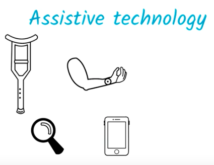
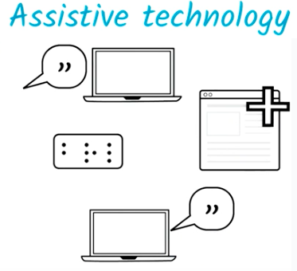

project_path: /web/_project.yaml
book_path: /web/fundamentals/_book.yaml
description: Introduction to assistive technology

{# wf_review_required #}
{# wf_updated_on: 2016-02-29 #}
{# wf_published_on: 2016-02-29 #}

# Assistive Technology {: .page-title }




*Assistive technology* is an umbrella term for devices, software, and tools that help any person with a disability complete a task. In the broadest sense this could be something low-tech like a crutch for walking or a magnifying glass for reading, or something high-tech like a robotic arm or image recognition software on a smartphone.

Assistive technology can include something as general as browser zoom, or as specific as a custom-designed game controller. It can be a separate physical device like a braille display, or be implemented completely in software like voice control. It can be built-in to the operating system like some screen readers, or it can be an add-on like a Chrome extension.

The line between assistive technology and technology in general is blurry; after all, all technology is meant to assist people with some task or another. And technologies can often move into and out of the "assistive" category.

For example, one of the earliest commercial speech synthesis products was a talking calculator for the blind. Now speech synthesis is all over the place, from driving directions to virtual assistants. Conversely, technology that was originally general-purpose often finds an assistive use. For example, people with low vision may use their smartphone's camera zoom to get a better look at something small in the real world.

In the context of web development, we must consider a diverse range of technologies. People may interact with your website using a screen reader or braille display, with a screen magnifier, via voice control, using a switch device, or with some other form of assistive technology that adapts the page's default interface to create a more specific interface that they can use.

Many of these assistive technologies rely on *programmatically expressed semantics* to create an accessible user experience, and that's what most of this lesson is about. But before we can explain programmatically expressed semantics, we need to talk a bit about *affordances*.
